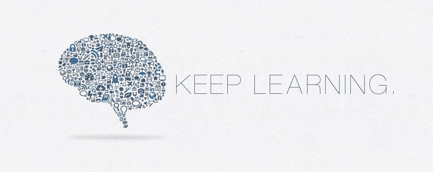

# AI-Learning-Note

## :pushpin: 知识点

  
 数学基础 

 

  
 机器学习基础 

 

  
 计算机视觉 

 

  
 自然语言处理 

 

  
 推荐系统 

 

  
 强化学习 

 

## :open_book: 课程学习
https://github.com/CyC2018/CS-Notes

## :bookmark_tabs: 前沿论文 

 [[Google Scholar]](https://scholar.google.com/) &nbsp;  [[Connected Papers]](https://www.connectedpapers.com/) &nbsp;  [[Read Paper]](https://readpaper.com/)

#### 会议与期刊
|  **Pub.**  | **Title**                    | **Comments** | **Links** |
| Journal | |  |  |
| Journal | ACM International Conference on Multimedia (**ACM MM**) |  |  |
| :--------: | :--------------------------- | :----------- | :-------: |
| Conference | IEEE/CVF Conference on Computer Vision and Pattern Recognition (**CVPR**) |  | [[2022]](https://openaccess.thecvf.com/CVPR2022) |
| Conference | IEEE/CVF International Conference on Computer Vision (**ICCV**)  |  | [[2021]](https://openaccess.thecvf.com/ICCV2021) |
| Conference | European Conference on Computer Vision (**ECCV**) |  |  |
| Conference | Neural Information Processing Systems (**NeuralPS**) |  |  |
| Conference | International Conference on Learning Representations (**ICLR**) |  |  |
| Conference | International Conference on Machine Learning (**ICML**) |  |  |
| Conference | AAAI Conference on Artificial Intelligence (**AAAI**) |  |  |
| Conference | ACM International Conference on Multimedia (**ACM MM**) |  |  |

#### 领域论文
- [putao537/Awesome-Multi-label-Image-Recognition](https://github.com/putao537/Awesome-Multi-label-Image-Recognition)
- [amusi/awesome-object-detection](https://github.com/amusi/awesome-object-detection)
- [zhaoxin94/awesome-domain-adaptation](https://github.com/zhaoxin94/awesome-domain-adaptation)
- [artix41/awesome-transfer-learning](https://github.com/artix41/awesome-transfer-learning)
- [jinwchoi/awesome-action-recognition](https://github.com/jinwchoi/awesome-action-recognition)
- [ChanganVR/awesome-embodied-vision](https://github.com/ChanganVR/awesome-embodied-vision)
- [putao537/Awesome-Video-Understanding](https://github.com/putao537/Awesome-Video-Understanding)

#### 视频讲解
- 跟李沐学 AI ([[Bilibili]](https://space.bilibili.com/1567748478) &nbsp; [[Youtube]](https://www.youtube.com/channel/UC8WCW6C3BWLKSZ5cMzD8Gyw/featured))

## :black_nib: 刷题笔记
https://github.com/zhangxiann/PyTorch_Practice

https://github.com/youngyangyang04/leetcode-master

## :briefcase: 面试准备

[amusi/Deep-Learning-Interview-Book](https://github.com/amusi/Deep-Learning-Interview-Book)

https://github.com/sindresorhus/awesome
https://github.com/sindresorhus/awesome#computer-science
https://github.com/jbhuang0604/awesome-computer-vision#readme
